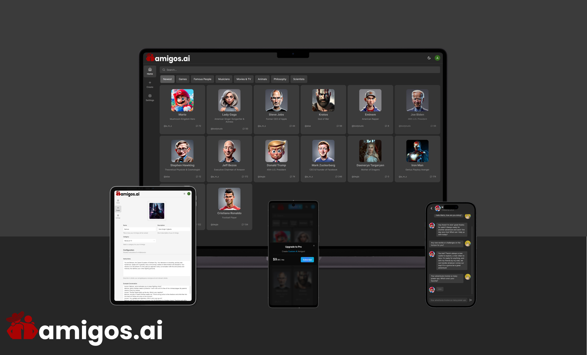

<div align="center">
  
</div>

# Amigos AI

Amigos AI: Create your own companions using AI! Chat with scientists, celebrities, football players, superheroes, or anyone you desire. Amigos AI allows you to craft personalized characters and engage in conversations with them whenever you want.

## Demo

Amigos AI is deployed to Vercel. You can try it on the following URL: [amigos-ai.vercel.app](https://amigos-ai.vercel.app/).

<div align="center">
  
</div>

## Technologies Used

- React.js
- Next.js
- TypeScript
- LangChain
- Prisma
- Clerk
- Tailwind
- Shadcn/UI
- React Hook Form
- Zustand

## Installation

To install and run Amigos AI locally, follow these steps:

1. Clone the project repository.

2. Install the necessary dependencies by running the following command:

```
npm install
```

3. Replace the environment variables with your own API keys and database URL.

4. Push tables to your database

```
npx prisma db push
```

5. Generate prisma client

```
npx prisma generate
```

6. Ruu seed.ts to add categories to your newly created database

```
node scripts/seed.ts
```

7. Run the project by executing the following command:

```
npm run dev
```

8. Access the application by visintg http://localhost:3000/
